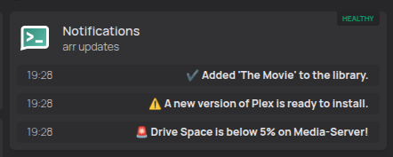
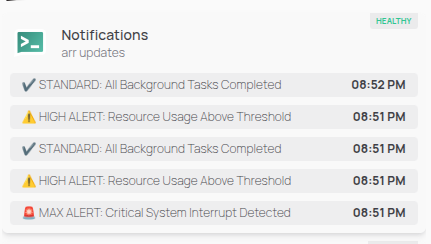

# 🔔 ntfy-adapter
---
ntfy-adapter is a widget for the Homepage dashboard that displays your latest NTFY notifications. It exposes a simple HTTP API returning the last five notifications with automatic priority-based formatting and expiry.
---

## ✨ Features

* **Priority-Based Status**: Automatically prefixes messages based on ntfy priority:
    * 🚨 **Urgent (5+)**: High-visibility alerts.
    * ⚠️ **High (4)**: Warning-level alerts.
    * ✔️ **Normal (1–3)**: Standard notifications.
* **Flexible Emoji Formatting**: 
    * **Unicode**: Use the `**U` prefix (e.g., `**U0001F6A8`).
    * **Shortcodes**: Wrap in asterisks (e.g., `*warning*`).
* **Smart Timezone Handling**: Localized timestamps via the `TZ` environment variable.
* **Customizable History**: Returns the last **5** notifications by default (configurable via `MAX_NOTIFICATIONS`).
* **URL Redaction**: Automatically replaces long URLs with `[URL]` to keep your feed clean.

---

## 🖼️ Example of the Homepage widget in both dark and light modes.

<p align="center">
  
  
</p>

---

# 🚀 Installation & Setup

## 1. Prerequisites
- A running **ntfy** instance (e.g., `http://192.168.1.50:8080` or `https://ntfy.domain.com`)
- A running **Homepage** instance (`https://gethomepage.dev`)
- Update your **ntfy** Docker Compose file to enable caching:

```yaml
environment:
  - NTFY_CACHE_FILE=/var/cache/ntfy/cache.db
  - NTFY_CACHE_DURATION=48h
volumes:
  - /path-to/ntfy/var/cache/ntfy:/var/cache/ntfy
```
- **Docker** and **Docker Compose** installed.

#### 2. Deployment Methods

##### Option A: Docker Compose (Recommended)
Create a `docker-compose.yml` file:

```yaml
services:
  ntfy-adapter:
    image: ghcr.io/chr0nzz/ntfy-adapter:latest
    container_name: ntfy-adapter
    restart: unless-stopped
    ports:
      - "5000:5000"
    environment:
      # --- Connection Settings ---
      - NTFY_URL=http://<YOUR_NTFY_IP>:<PORT>
      - TZ=America/Toronto

      # --- Notification Limits ---
      # Max number of messages returned in the list (Default: 5)
      - MAX_NOTIFICATIONS=5

      # --- Expiry Settings (Hours) ---
      # How long messages stay visible based on priority
      - EXPIRY_MAX=48        # Priority 5
      - EXPIRY_HIGH=24       # Priority 4
      - EXPIRY_STANDARD=12   # Priority 1-3

      # --- Visual Customization ---
      # Use **U prefix for Unicode or *short_code* for emojis
      - EMOJI_MAX=**U0001F6A8
      - EMOJI_HIGH=*warning*
      - EMOJI_STANDARD=*check_mark*
```

Run the command:
```bash
docker compose up -d
```

##### Option B: Docker Run
Run the container with a single command:
```bash
docker run -d \
  --name ntfy-adapter \
  -p 5000:5000 \
  -e NTFY_URL="http://<YOUR_NTFY_IP>:<PORT>" \
  -e TZ="America/Toronto" \
  ghcr.io/chr0nzz/ntfy-adapter:latest
```
Override notification expiry:
```bash
docker run -d \
  --name ntfy-adapter \
  -p 5000:5000 \
  -e NTFY_URL="http://<YOUR_NTFY_IP>:<PORT>" \
  -e TZ="America/Toronto" \
  -e EXPIRY_MAX="24" \
  -e EXPIRY_HIGH="12" \
  -e EXPIRY_STANDARD="6" \
  ghcr.io/chr0nzz/ntfy-adapter:latest
```
---

## 🛠 Build from Source
If you want to build the image yourself instead of pulling from a registry:

1. **Clone the repository**:
   ```bash
   git clone https://github.com/chr0nzz/ntfy-adapter.git
   cd ntfy-adapter
   ```

2. **Build the Docker image**:
   ```bash
   docker build -t ntfy-adapter:local .
   ```

3. **Run your local build**:
   ```bash
   docker run -d -p 5000:5000 -e NTFY_URL="http://<IP>:<PORT>" ntfy-adapter:local
   ```

---

## 🏠 Homepage Widget Configuration
Add the following to your `services.yaml` file in Homepage:
You can add one widget per ntfy topic.

```yaml
- Notifications:
    # href: https://ntfy.domain.com/topic
    # icon: sh-ntfy
    widget:
      type: customapi
      # change to your adapter ip and NTFY topic #
      url: http://<ADAPTER_IP>:5000/notifications?topic=<YOUR_TOPIC>
      display: dynamic-list
      refreshInterval: 5000
      method: get
      mappings:
        label: time
        name: message
```

---

## ⚙️ Environment Variables

| Variable            | Description                                  | Example                                                 |
| :------------------ | :------------------------------------------- | :------------------------------------------------------ |
| `NTFY_URL`          | The URL of your ntfy server                  | `http://192.168.1.10:8080` or `https://ntfy.domain.com` |
| `TZ`                | Your local timezone for timestamps           | `America/Toronto`                                       |
| `MAX_NOTIFICATIONS` | Returns the max number of notifications      | `5`                                                     |
| `EXPIRY_MAX`        | Expiry time (hours) for Urgent notifications | `24`                                                    |
| `EXPIRY_HIGH`       | Expiry time (hours) for High notifications   | `12`                                                    |
| `EXPIRY_STANDARD`   | Expiry time (hours) for Normal notifications | `6`                                                     |
| `EMOJI_MAX`         | Emoji for urgent notifications               | `**U0001F6A8` or `*rotating_light*`                     |
| `EMOJI_HIGH`        | Emoji for high notifications                 | `*warning*`                                             |
| `EMOJI_STANDARD`    | Emoji for normal notifications               | `*white_check_mark*`                                    |


## 🤝 Contributing
Issues and pull requests are welcome! Feel free to open a ticket if you have suggestions for new features.

## 📄 License
This project is licensed under the MIT License.
