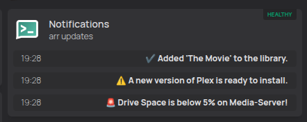
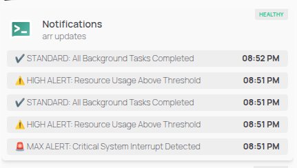
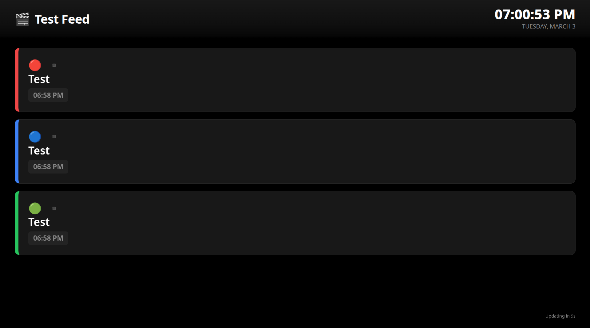

🔔 ntfy-adapter
===============

ntfy-adapter is a customizable bridge for [ntfy](https://ntfy.sh "null") that fetches, filters, and formats notifications for display in [Homepage](https://gethpmepage.dev) dashboard widgets or a dedicated full-screen status board. It supports automatic priority-based formatting, individual topic limits, and flexible retention policies.

✨ Features
----------

-   **Multi-topic Support**: Aggregates notifications from one or more topics.

-   **Per-Topic Limits**: Displays the last **N** notifications (Default: 5) for *each* topic individually.

-   **Priority-Based Status**: Automatically prefixes messages based on ntfy priority:

    -   🚨 **Urgent (5+)**: High-visibility alerts.

    -   ⚠️ **High (4)**: Warning-level alerts.

    -   ✔️ **Normal (1--3)**: Standard notifications.

-   **Flexible Emoji Formatting**:

    -   **Unicode**: Use the `**U` prefix (e.g., `**U0001F6A8`).

    -   **Shortcodes**: Wrap in asterisks (e.g., `*warning*`).

-   **Smart Timezone Handling**: Localized timestamps via the `TZ` environment variable.

-   **URL Handling**: Automatically replaces long URLs with `🔗` to keep feeds clean while maintaining clickability.

-   **Dedicated Display UI**: A built-in, auto-refreshing full-screen status board (`/display`).

## 🕒 Retention Policy

Notifications are filtered based on their age and priority level:

| Priority | Level  | Default Expiry | Env Variable      |
| :------- | :----- | :------------- | :---------------- |
| **5+** | Urgent | **48 Hours** | `EXPIRY_MAX`      |
| **4** | High   | **24 Hours** | `EXPIRY_HIGH`     |
| **1-3** | Normal | **12 Hours** | `EXPIRY_STANDARD` |

---
## 🖼️ Example of the Homepage widget in both dark and light modes.

<p align="center">
  
  
  
</p>

---

# 🚀 Installation & Setup

## 1. Prerequisites
- A running **ntfy** instance (e.g., `http://192.168.1.50:8080` or `https://ntfy.domain.com`)
- A running **Homepage** instance (`https://gethomepage.dev`)
- Update your **ntfy** Docker Compose file to enable caching:

```yaml
environment:
  - NTFY_CACHE_FILE=/var/cache/ntfy/cache.db
  - NTFY_CACHE_DURATION=48h
  # fix for error 409, adjust for your IP if needed
  - NTFY_VISITOR_REQUEST_LIMIT_EXEMPT_HOSTS=127.0.0.1,10.0.0.0/8,172.16.0.0/12,192.168.0.0/16,100.64.0.0/10
volumes:
  - /path-to/ntfy/var/cache/ntfy:/var/cache/ntfy
```
- **Docker** and **Docker Compose** installed.

#### 2. Deployment Methods

##### Option A: Docker Compose (Recommended)
Create a `docker-compose.yml` file:

```yaml
services:
  ntfy-adapter:
    image: ghcr.io/chr0nzz/ntfy-adapter:latest
    container_name: ntfy-adapter
    restart: unless-stopped
    ports:
      - "5000:5000"
    environment:
      # --- Connection Settings ---
      - NTFY_URL=http://<YOUR_NTFY_IP>:<PORT>
      - TZ=America/Toronto
      - CLOCK_FORMAT=24h     # Set time format 12h or 24h
      - ENABLE_DISPLAY=true  # Set to false to disable

      # --- AUTH ---
      # Leave these as empty strings or comment them out if NOT using auth
      - NTFY_USER=
      - NTFY_PASS=

      # --- Notification Limits ---
      # Max number of messages returned in the list (Default: 5)
      - MAX_NOTIFICATIONS=5

      # --- Expiry Settings (Hours) ---
      # How long messages stay visible based on priority
      - EXPIRY_MAX=48        # Priority 5
      - EXPIRY_HIGH=24       # Priority 4
      - EXPIRY_STANDARD=12   # Priority 1-3

      # --- Visual Customization ---
      # Use **U prefix for Unicode or *short_code* for emojis
      - EMOJI_MAX=**U0001F6A8
      - EMOJI_HIGH=*warning*
      - EMOJI_STANDARD=*check_mark*
    
    # --- Optional for Display UI customization ---
    volumes:
      - ./config.json:/app/config.json
```

Run the command:
```bash
docker compose up -d
```

##### Option B: Docker Run
Run the container with a single command:
```bash
docker run -d \
  --name ntfy-adapter \
  -p 5000:5000 \
  -e NTFY_URL="http://<YOUR_NTFY_IP>:<PORT>" \
  -e TZ="America/Toronto" \
  ghcr.io/chr0nzz/ntfy-adapter:latest
```
Override notification expiry:
```bash
docker run -d \
  --name ntfy-adapter \
  -p 5000:5000 \
  -e NTFY_URL="http://<YOUR_NTFY_IP>:<PORT>" \
  -e TZ="America/Toronto" \
  -e EXPIRY_MAX="24" \
  -e EXPIRY_HIGH="12" \
  -e EXPIRY_STANDARD="6" \
  ghcr.io/chr0nzz/ntfy-adapter:latest
```
---

## 🛠 Build from Source
If you want to build the image yourself instead of pulling from a registry:

1. **Clone the repository**:
   ```bash
   git clone https://github.com/chr0nzz/ntfy-adapter.git
   cd ntfy-adapter
   ```

2. **Build the Docker image**:
   ```bash
   docker build -t ntfy-adapter:local .
   ```

3. **Run your local build**:
   ```bash
   docker run -d -p 5000:5000 -e NTFY_URL="http://<IP>:<PORT>" ntfy-adapter:local
   ```

---

## 🏠 Homepage Widget Configuration
Add the following to your `services.yaml` file in Homepage:

You can add one widget per ntfy topic, or group them by separating them with a comma (e.g., media,alerts)

```yaml
- Notifications:
    # href: https://ntfy.domain.com/topic
    # icon: sh-ntfy
    widget:
      type: customapi
      # change to your adapter ip and NTFY topic or
      # group them by separating them with a comma (e.g., media,alerts)
      url: http://<ADAPTER_IP>:5000/notifications?topic=<YOUR_TOPIC>
      display: dynamic-list
      refreshInterval: 5000
      method: get
      mappings:
        label: time
        name: message
        target: "{click_url}"
```

---

📺 Dedicated Display UI (`/display`)
------------------------------------

The adapter includes a dedicated page for monitors or tablets. Customize it by creating a `config.json` in the same directory as your Docker Compose file.

### Configuration (`config.json`)

```
{
  "theme": "dark",
  "auto_scroll": true,
  "display_title": "Home Monitoring",
  "display_icon": "🏠",
  "api": {
    "host_ip": "192.168.1.10",
    "port": "5000",
    "topic": "media,alerts,security",
    "refresh_rate": 10000
  }
}

```

### Display Settings Details

-   **`theme`**: `"dark"` or `"light"`.

-   **`auto_scroll`**: Enables vertical scrolling if notifications exceed screen height.

-   **`display_title`**: Header text (Defaults to topic name if empty).

-   **`display_icon`**: Header emoji icon.

-   **`api.topic`**: Comma-separated list of topics to fetch.

-   **`api.refresh_rate`**: How often (ms) the UI polls for new data.

### Access Display
```
http://<ADAPTER_IP>:5000/display
```

---
## ⚙️ Environment Variables

| Variable            | Description                                  | Example                                                 |
| :------------------ | :------------------------------------------- | :------------------------------------------------------ |
| `NTFY_URL`          | The URL of your ntfy server                  | `http://192.168.1.10:8080` or `https://ntfy.domain.com` |
| `NTFY_USER`         | The User of your ntfy server                 | `leave empty if none`                                   |
| `NTFY_PASS`         | The Password of your ntfy server             | `leave empty if none`                                   |
| `ENABLE_DISPLAY`    | Toggle the /display UI                       | `true / false`                                          |
| `TZ`                | Your local timezone for timestamps           | `America/Toronto`                                       |
| `CLOCK_FORMAT`      | Set time format for timestamps               | `24h` or `12h`                                          |
| `MAX_NOTIFICATIONS` | Returns the max number of notifications      | `5`                                                     |
| `EXPIRY_MAX`        | Expiry time (hours) for Urgent notifications | `24`                                                    |
| `EXPIRY_HIGH`       | Expiry time (hours) for High notifications   | `12`                                                    |
| `EXPIRY_STANDARD`   | Expiry time (hours) for Normal notifications | `6`                                                     |
| `EMOJI_MAX`         | Emoji for urgent notifications               | `**U0001F6A8` or `*rotating_light*`                     |
| `EMOJI_HIGH`        | Emoji for high notifications                 | `*warning*`                                             |
| `EMOJI_STANDARD`    | Emoji for normal notifications               | `*white_check_mark*`                                    |


## 🤝 Contributing
Issues and pull requests are welcome! Feel free to open a ticket if you have suggestions for new features.

  ---
  
  ## 📄 License

  This project is licensed under the **GNU General Public License v3.0**.
  
  Copyright (C) 2026 chronzz (<https://github.com/chr0nzz>)
